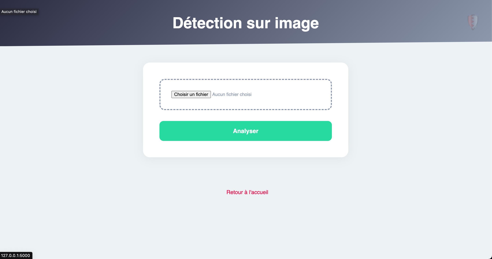
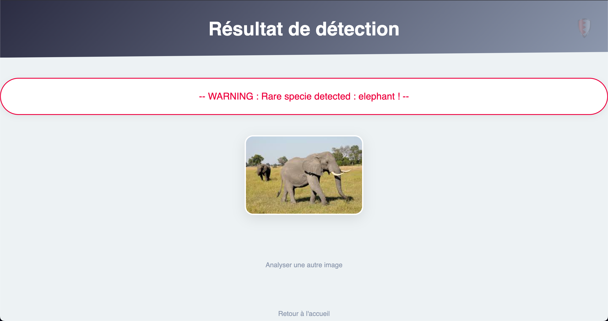
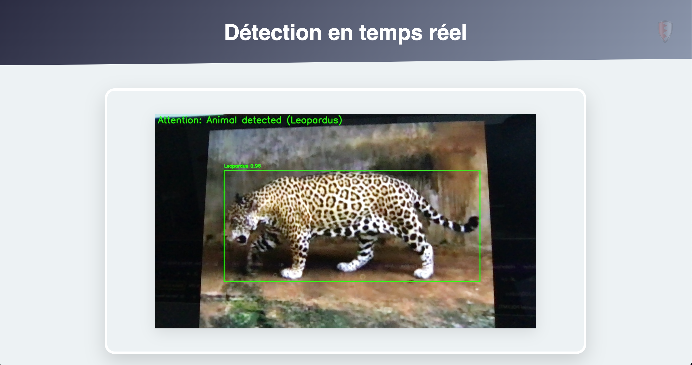

# 🛡️ WildGuard - Protection de la Faune Sauvage

[](https://opensource.org/licenses/MIT)
[](https://www.python.org/)
[](https://opencv.org/)

**Solution IA de surveillance écologique pour lutter contre le braconnage et protéger les espèces menacées**

### Interface d'acceuil


### Interfaces de détections pat photo et résultat de l'analyse




### Interfaces de détections pat vidéo et analyse temps réel



## 🌟 Fonctionnalités Principales
- 🎥 Analyse vidéo en direct avec YOLOv8
- 📸 Détection sur images statiques
- 🔔 Alertes SMS instantanées via Twilio
- 🦁 Identification de 50+ espèces menacées
- 📊 Interface web intuitive
- 🚨 Historique des détections

## 🛠 Technologies Clés
| Composant               | Technologie                          |
|-------------------------|--------------------------------------|
| **Détection IA**        | YOLOv8, OpenCV                       |
| **Backend**             | Python 3.9, Flask                    |
| **Interface**           | HTML5, CSS3 modern                   |
| **Notifications**       | Twilio (SMS), Socket.IO              |
| **Gestion modèle**      | PyTorch, Ultralytics                 |

## 🚀 Installation Rapide

```bash
# 1. Cloner le dépôt
git clone https://github.com/votreprofil/WildGuard.git
cd WildGuard

# 2. Configurer l'environnement
python -m venv venv
source venv/bin/activate  # Linux/Mac
venv\Scripts\activate     # Windows
pip install -r requirements.txt

# 3. Configurer Twilio (SMS)
cp config.example.py config.py
# Remplir TWILIO_ACCOUNT_SID et TWILIO_AUTH_TOKEN

# 4. Lancer l'application
python app.py
```

### **Structure du projet**

WildGuard/
├── backend/              # Cœur logique
│   ├── detection.py      # Détection d'objets
│   └── processing/       # Traitement des images
├── static/               # Assets statiques
│   └── css/              # Styles CSS modernes
│       └── style.css     
├── templates/            # Interface utilisateur
│   ├── index.html        # Page principale
│   ├── video.html        # Flux temps réel
│   ├── upload.html       # Upload d'image
│   └── result.html       # Résultats d'analyse
├── images/               # Captures d'écran
├── test_images/          # Images de test
├── venv/                 # Environnement virtuel
├── app.py                # Application Flask
├── alert_notifications.py # Gestion des alertes
├── real_time_detection.py # Analyse vidéo
└── yolov8n.pt            # Modèle IA entraîné
